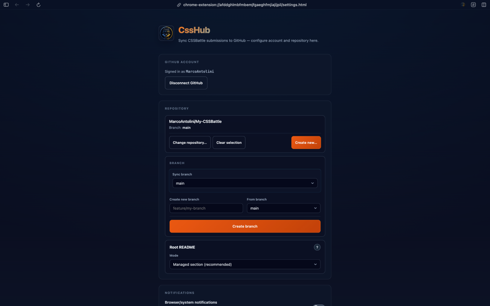
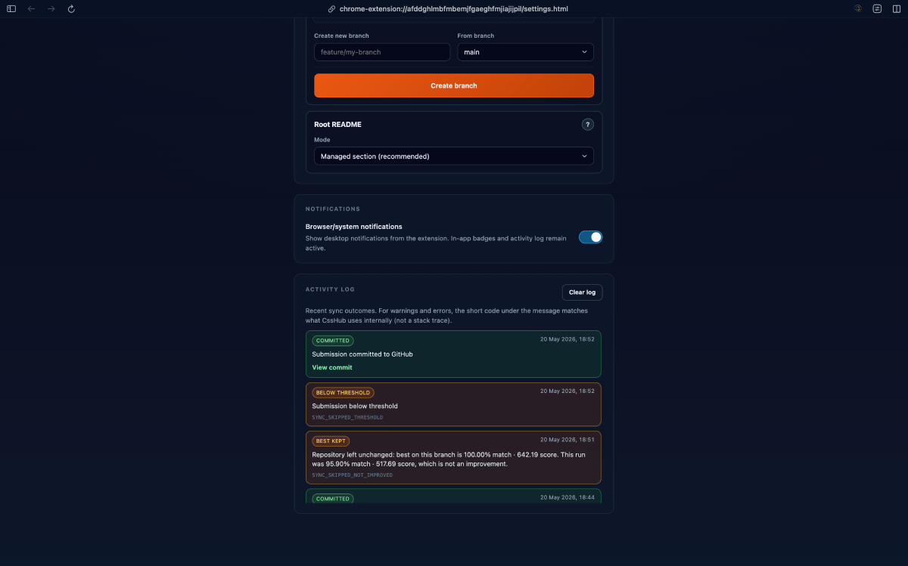
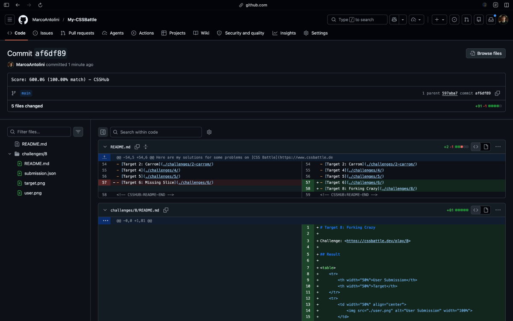
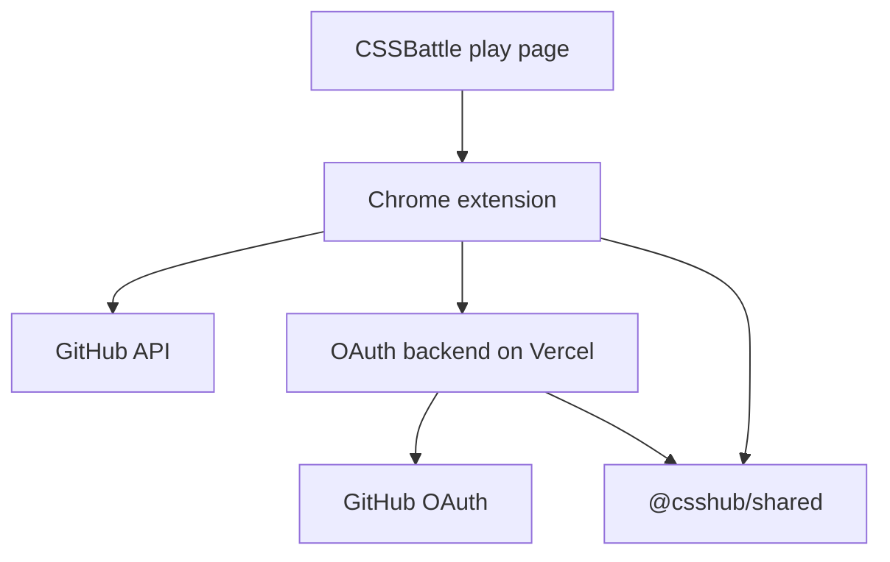

<div align="center">


<br />

**Automatically sync your [CSSBattle](https://cssbattle.dev) submissions to GitHub.**

[](https://chromewebstore.google.com/detail/csshub/oakkijoinjkdhcgnpnmnpjkmpdekajid)
[](https://github.com/MarcoAntolini/CSSHub/releases)
[](LICENSE)
[](https://github.com/MarcoAntolini/CSSHub/stargazers)

</div>

---

## What is CssHub?

CssHub is a **Chrome extension** that pushes your CSSBattle solutions into a **GitHub repository** you choose—so every pass becomes a commit you can browse, diff, and share like normal code.

No copy-paste, no drag-and-drop zip files: you play on CSSBattle, CssHub keeps your repo up to date.

## Why CssHub?

- **One place for your battles** — Challenges and submissions live in a repo structure you control.
- **Git history as your progress log** — See how your solutions evolved over time.
- **Backup & portfolio** — Your work stays on GitHub even if you clear browser data (once synced).
- **Built for CSSBattle** — Works on the official play experience you already use.

## Screenshots

<p align="center">
  
</p>

<p align="center">
  
  
</p>

<p align="center">
  
</p>

## Quick Start

### Use CssHub (players)

1. **[Install from the Chrome Web Store](https://chromewebstore.google.com/detail/csshub/oakkijoinjkdhcgnpnmnpjkmpdekajid)** — updates install automatically.
2. Pin **CssHub** from the puzzle menu if you want quick access.
3. Open **Settings** → **Sign in with GitHub** → choose your **repository** (and branch if needed).
4. Open a **CSSBattle** play page and solve as usual—CssHub syncs your submission when you use the extension flow on that challenge.

Use **Google Chrome** (or another Chromium browser with Manifest V3 support). Supported hosts: `cssbattle.dev` and `www.cssbattle.dev`.

### Develop from source (maintainers)

```bash
git clone https://github.com/MarcoAntolini/CSSHub.git
cd CSSHub
npm ci
```

Copy env examples and fill in values:

```bash
cp apps/backend/.env.example apps/backend/.env.local
cp apps/extension/.env.development.example apps/extension/.env.development.local
```

Start the OAuth backend and extension watch build:

```bash
npm run dev
```

Load the unpacked extension from `apps/extension/dist`. Full env, OAuth callback, and CI notes: **[`apps/extension/README.md`](apps/extension/README.md)** and **[`apps/backend/README.md`](apps/backend/README.md)**.

## Project structure

```
.
├── apps/
│   ├── backend/          # Vercel OAuth API (GitHub web OAuth only)
│   └── extension/        # Chrome extension (content scripts, popup, settings)
├── docs/                 # Privacy policy, ops runbook, screenshots
├── packages/
│   └── shared/           # Shared TypeScript contracts and OAuth schemas
├── scripts/              # OAuth doctor, store packaging, CI helpers
├── CHANGELOG.md
├── LICENSE
└── package.json
```

## Architecture



The extension reads submission data on CSSBattle, syncs commits via the GitHub API, and uses the backend only for **web OAuth** (client secret stays on the server). Device flow and PAT sign-in bypass the backend.

## Documentation

| Resource | Description |
|----------|-------------|
| [`apps/extension/README.md`](apps/extension/README.md) | Extension scripts, env vars, CI artifacts, store packaging |
| [`apps/backend/README.md`](apps/backend/README.md) | OAuth API routes, Vercel deploy, health check |
| [`docs/privacy-policy.md`](docs/privacy-policy.md) | Privacy policy (published at [marcoantolini.github.io/CSSHub](https://marcoantolini.github.io/CSSHub/privacy-policy.html)) |
| [`docs/privacy-data-map.md`](docs/privacy-data-map.md) | Data inventory: storage, hosts, retention |
| [`docs/ops-runbook.md`](docs/ops-runbook.md) | Maintainer ops: OAuth failures, Redis, rollback |
| [`CHANGELOG.md`](CHANGELOG.md) | Release history |

## Privacy in plain English

- CssHub needs **GitHub access** only to write to **your** chosen repo (and related metadata like branches).
- Your **GitHub token is kept in session-only extension storage** on your device (cleared on sign-out); settings and an activity log (up to **15** events) stay in local extension storage—not on a CssHub account in the cloud.
- CssHub only runs on **CSSBattle** play pages, plus **GitHub** and the **OAuth backend** for sign-in and sync.
- **No CssHub analytics** — no first-party tracking or advertising SDK.
- **Privacy policy:** <https://marcoantolini.github.io/CSSHub/privacy-policy.html> (source in [`docs/privacy-policy.md`](docs/privacy-policy.md)).
- Technical inventory: [`docs/privacy-data-map.md`](docs/privacy-data-map.md). Extension and backend details: [`apps/extension/README.md`](apps/extension/README.md), [`apps/backend/README.md`](apps/backend/README.md).
- Chrome Web Store listing draft (maintainer, local): `docs/internal/chrome-web-store-listing.md` (gitignored).

## Support

Using CssHub? Install or update from the [Chrome Web Store](https://chromewebstore.google.com/detail/csshub/oakkijoinjkdhcgnpnmnpjkmpdekajid). If something breaks or you want a feature, open a [GitHub issue](https://github.com/MarcoAntolini/CSSHub/issues)—the [bug report](https://github.com/MarcoAntolini/CSSHub/issues/new?template=bug_report.yml) and [feature request](https://github.com/MarcoAntolini/CSSHub/issues/new?template=feature_request.yml) templates include the fields we need (CSSBattle URL, extension version, steps to reproduce).

## Contributing

Pull requests are welcome. GitHub applies the [PR template](https://github.com/MarcoAntolini/CSSHub/blob/main/.github/pull_request_template.md) automatically; for larger changes, start with an issue so we can align on scope. Maintainer ops (OAuth, rollback): [`docs/ops-runbook.md`](docs/ops-runbook.md).

If CssHub saves you time, **star** this repo—it helps other CSSBattle players find it.

<a href="https://github.com/MarcoAntolini/CSSHub/graphs/contributors">
  
</a>

## License

MIT — see [LICENSE](LICENSE).
