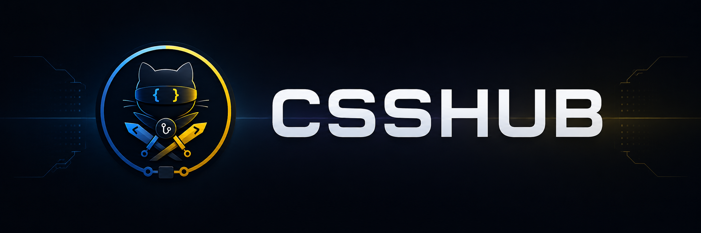
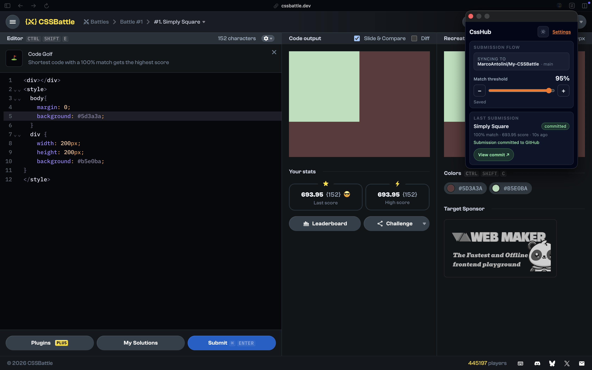

 

**Automatically sync your [CSSBattle](https://cssbattle.dev) submissions to GitHub.**

---

## What is CssHub?

CssHub is a **Chrome extension** that pushes your CSSBattle solutions into a **GitHub repository** you choose—so every pass becomes a commit you can browse, diff, and share like normal code.

No copy-paste, no drag-and-drop zip files: you play on CSSBattle, CssHub keeps your repo up to date.

## Why CssHub?

- **One place for your battles** — Challenges and submissions live in a repo structure you control.
- **Git history as your progress log** — See how your solutions evolved over time.
- **Backup & portfolio** — Your work stays on GitHub even if you clear browser data (once synced).
- **Built for CSSBattle** — Works on the official play experience you already use.

## Screenshot

_Screenshots coming soon._  
When they are ready, add images here (for example under `docs/screenshots/`) so newcomers immediately see the popup and settings flow.

<!-- Example (uncomment when files exist):

  

-->

## Supported platform

- **[CSSBattle](https://cssbattle.dev)** — `cssbattle.dev` and `www.cssbattle.dev` (play URLs).

Use **Google Chrome** (or another Chromium browser with Manifest V3 support).

## Installation

### 1. Chrome Web Store (recommended)

**[Install CssHub from the Chrome Web Store](https://chromewebstore.google.com/detail/csshub/jafemcjfpjjdbcfjjfohjfglckbkjbbp)** — updates install automatically.

### 2. Manual install (developers)

If you build from source, load the unpacked extension from `apps/extension/dist` after a build. Full setup (env files, local OAuth backend, scripts) is in **[`apps/extension/README.md`](apps/extension/README.md)**.

## After you install

1. Pin **CssHub** from the puzzle menu if you like quick access.
2. Open **CssHub** → **Settings** (or the extension options page).
3. **Sign in with GitHub** (pick the method you prefer in settings).
4. Choose the **repository** (and branch, if you use something other than the default).
5. Open a **CSSBattle** play page and solve as usual—CssHub syncs your submission to GitHub when you use the extension flow on that challenge.

If something fails, check the in-extension activity log in settings for a short, human-readable message.

## Privacy in plain English

- CssHub needs **GitHub access** only to write to **your** chosen repo (and related metadata like branches).
- Your **GitHub token is kept in session-only extension storage** on your device (cleared on sign-out); other settings and the activity log stay in local extension storage—not on a CssHub account in the cloud.
- CssHub only runs on **CSSBattle** play pages, plus **GitHub** and the **OAuth backend** for sign-in and sync.
- **No CssHub analytics** — no first-party tracking or advertising SDK.
- **Privacy policy:** https://marcoantolini.github.io/CSSHub/privacy-policy.html (source in [`docs/privacy-policy.md`](docs/privacy-policy.md); enable GitHub Pages from `/docs` if the URL is not live yet).
- Technical inventory: [`docs/privacy-data-map.md`](docs/privacy-data-map.md). Extension and backend details: [`apps/extension/README.md`](apps/extension/README.md), [`apps/backend/README.md`](apps/backend/README.md).
- Chrome Web Store permission copy: [`docs/chrome-web-store-listing.md`](docs/chrome-web-store-listing.md).

## Contributing

Ideas, issues, and pull requests are welcome.

If CssHub saves you time, consider **starring** this repository—it helps others discover it.  
Want a feature? Open an issue and describe the workflow you have in mind.
