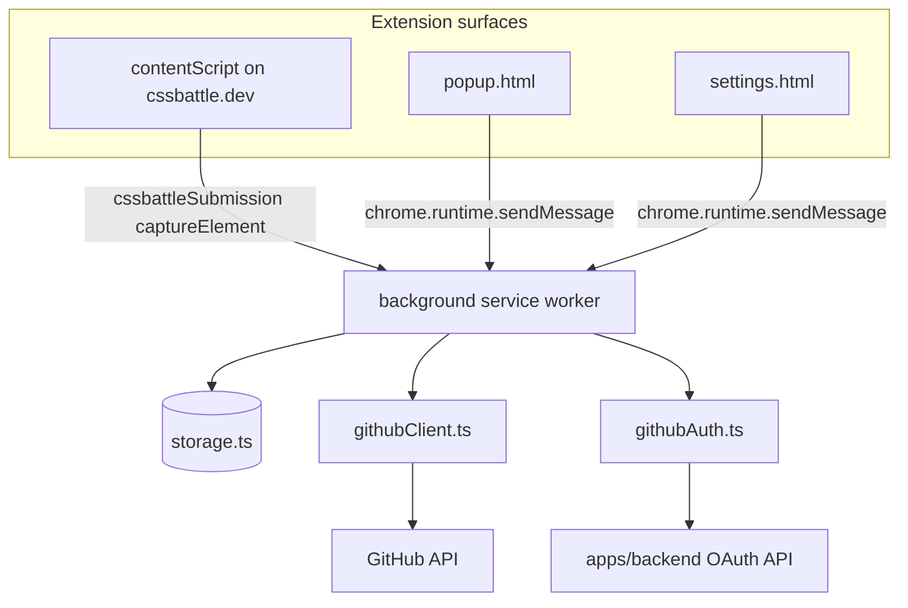

# CssHub Architecture Review

Snapshot: 2026-05-15. Complements [`privacy-data-map.md`](./privacy-data-map.md) and [`release-readiness-checklist.md`](./release-readiness-checklist.md).

## System overview

CssHub is a Chrome MV3 extension that watches CSSBattle submissions and syncs qualifying solutions to a user-selected GitHub repository. A small Vercel serverless backend performs OAuth code exchange so the client secret never ships in the extension bundle.

## Monorepo layout

| Path | Role |
|------|------|
| `apps/extension` | MV3 extension (Vite build → `dist/`) |
| `apps/backend` | Vercel serverless OAuth (`/api/oauth/github/*`) |
| `scripts/` | Root tooling (`test-security.mjs`) |
| `docs/` | Privacy, release, architecture notes |

Shared types and Zod schemas live in `apps/extension/src/shared/` (not yet extracted to `packages/shared`).

## Extension modules and responsibilities

| Module | Responsibility | Notes |
|--------|----------------|-------|
| `background.ts` | Message router, submission ingestion, capture, GitHub commits, notifications/badge | ~1.2k lines; highest complexity |
| `contentScript.ts` | DOM hooks on CSSBattle play pages; detect submit; build payload; request capture | DOM-heuristic driven; no React |
| `popup.tsx` | Threshold slider, last submission card, link to settings | Reads state via `getExtensionState` |
| `settings.tsx` | Auth (web/device/PAT), repo/branch UX, activity log, README mode | Large React surface (~1.5k lines) |
| `storage.ts` | Persist settings/events; session token split | Single source of truth for persistence |
| `githubClient.ts` | GitHub REST (repos, branches, commits, README) | Token from stored state |
| `githubAuth.ts` | Web/device/PAT flows; backend exchange for web OAuth | Env: `VITE_OAUTH_BACKEND_BASE_URL` |
| `rootReadme.ts` | README index generation (managed-section markers) | Used from background on commit |
| `shared/contracts.ts` | Zod schemas for messages and API shapes | Parse at boundaries |
| `shared/eventTone.ts` | Map ingestion/sync codes → UI tone | Shared popup + settings |

### Boundary rules (current)

- **UI never calls GitHub directly** — popup/settings/content script talk only to the background via `chrome.runtime.sendMessage`.
- **Contracts at the edge** — `popupToBackgroundMessageSchema` validates outbound messages; responses use `extensionStateResponseSchema` / handler-specific shapes where implemented.
- **Token never in `chrome.storage.local`** — `saveStoredState` strips `githubToken` before local write; session key `csshub_github_token_v1` holds the secret.

## Message contract

`popupToBackgroundMessageSchema` (`shared/contracts.ts`) is the discriminated union for background actions:

| Action | Caller | Purpose |
|--------|--------|---------|
| `getExtensionState` | popup, settings | Full snapshot for UI |
| `saveSettings` | popup, settings | Persist user preferences |
| `startGithubWebFlow` / `startGithubDeviceFlow` / `pollGithubDeviceFlow` / `loginWithPat` / `logoutGithub` | settings | Auth lifecycle |
| `listRepos` / `listBranches` / `createRepo` / `createBranch` | settings | Repository setup |
| `clearRecentEvents` | settings | Activity log reset |
| `cssbattleSubmission` | content script | Ingest submission |
| `captureElement` / `extractCssbattleEditorCode` | background (via tabs) / content | Screenshot and editor code |
| `getElementPositionAndDimensions` | runtime schema only | Legacy/auxiliary capture geometry |

`runtimeMessageSchema` still lists `cropImage`; the content script no longer sends it (capture path uses `captureElement` in the service worker).

Handlers are registered in a `actionHandlers` map at the bottom of `background.ts`; auth-gated GitHub calls use `getAuthenticatedState()`.

## Storage model

| Data | `chrome.storage.local` (`csshub_state_v1`) | `chrome.storage.session` |
|------|---------------------------------------------|---------------------------|
| Settings, auth flags, last submission, ingestion, events, fingerprint | Yes | No |
| GitHub access token | No (stripped on save) | Yes (`csshub_github_token_v1`) |

`getStoredState` heals mismatches when local says authenticated but session token is missing (browser restart).

## Submission pipeline (happy path)

1. User submits on CSSBattle → content script observes DOM, debounces with `isProcessingSubmission`.
2. Content script sends `cssbattleSubmission` with code, scores, optional images.
3. Background: duplicate window (fingerprint + ~45s), threshold check, repo/branch validation.
4. On accept: `githubClient` creates/updates files; optional `rootReadme` update per `repositoryReadmeMode`.
5. Persist `lastSubmission`, `lastIngestion`, append sanitized `recentEvents`; optional `chrome.notifications` if enabled.
6. Popup/settings refresh via `chrome.storage.onChanged` (popup) or explicit reload (settings).

## Backend (OAuth only)

| Endpoint | Purpose |
|----------|---------|
| `POST /api/oauth/github/state` | Issue CSRF `state` |
| `POST /api/oauth/github/exchange` | Exchange `code` for token (secret server-side) |
| `GET /api/oauth/github/health` | Health check |

Supporting libs: CORS allowlist, Redis rate limit, redirect URI whitelist, env validation. Extension web flow calls exchange; device/PAT bypass backend for token acquisition.

## Quality and CI

Root scripts: `typecheck`, `test` (Vitest), `test:e2e` (Playwright on unpacked `dist`), `lint`, `test:security` (+ `strict` / `json`).

`.github/workflows/quality-gates.yml`: `npm ci` → Playwright Chromium → typecheck → **lint** → unit tests → xvfb e2e → security JSON artifact.

## Findings (strengths)

- Clear MV3 split: content (page) vs service worker (privileged) vs UI pages.
- Zod contracts reduce “stringly typed” message bugs.
- Session/local token split limits token exposure in durable storage.
- Sanitized activity events and shared `eventTone` keep popup/settings consistent.
- E2E smoke covers auth states, notifications toggle, clear log, disconnect.

## Backlog (recommended refactors)

Priority by risk/ROI, not blocking release if gates are green.

1. **`background.ts` decomposition** — Extract modules: `handlers/auth.ts`, `handlers/github.ts`, `handlers/submission.ts`, `capture.ts`, `notifications.ts`. Keep `actionHandlers` registry in a thin `background.ts`.
2. **`settings.tsx` decomposition** — Extract hooks (`useExtensionState`, `useRepoPicker`, `useDeviceFlow`) and presentational sections (Auth, Repository, Activity log). Reduces effect-order coupling.
3. **Align runtime contracts** — Remove or re-wire unused `cropImage` / `getElementPositionAndDimensions` entries in `runtimeMessageSchema` if no caller remains.
4. **Shared response helper** — `sendBackgroundMessage` + ok/error parsing exists in settings; popup still inlines `chrome.runtime.sendMessage`. A tiny `shared/messaging.ts` would DRY without over-abstracting.
5. **Bundle size** — `eventTone` chunk ~230 KB gzip ~70 KB (React + sonner in shared chunk). Consider lazy-loading sonner on settings only or splitting vendor chunk for popup.
6. **`packages/shared`** — Promote `contracts.ts` (+ types) when backend needs the same schemas; until then duplication risk is low (backend is OAuth-only).
7. **Content script resilience** — DOM selectors are inherently brittle; document selector inventory and add integration tests with fixture HTML when CSSBattle markup shifts.

## Performance baseline (production build, 2026-05-15)

| Artifact | Size (gzip) |
|----------|-------------|
| `background.js` | 26.2 KB (8.9 KB) |
| `settings.js` | 27.5 KB (7.6 KB) |
| `popup.js` | 5.8 KB (2.2 KB) |
| `contentScript.js` | 5.3 KB (2.3 KB) |
| `assets/vendor-react-*.js` | 185.4 KB (57.8 KB) |
| `assets/vendor-sonner-*.js` | 33.0 KB (9.3 KB) — settings only |
| `assets/eventTone-*.js` | 1.3 KB (0.7 KB) |

Enforced in CI via `npm run check:bundle-budgets` after `build:extension:prod`. See [`performance.md`](./performance.md).

## Security architecture (cross-cutting)

- Web OAuth: secret on Vercel only; extension receives token over HTTPS to configured backend.
- PAT/device: token validated against GitHub API before persistence.
- Logout: `clearAuthState` clears session + local auth flags.
- Manifest: `storage`, `activeTab`, `tabs`, `identity`, `scripting`, `notifications` + host permissions for GitHub and CSSBattle only.

See backend README and `scripts/test-security.mjs` for operational gates.

## Related docs

- [`privacy-data-map.md`](./privacy-data-map.md) — data inventory and flows
- [`release-readiness-checklist.md`](./release-readiness-checklist.md) — pre-store checklist
- [`.cursor/plans/csshub_rollout_plan_acfb5bfe.plan.md`](../.cursor/plans/csshub_rollout_plan_acfb5bfe.plan.md) — phased rollout status
